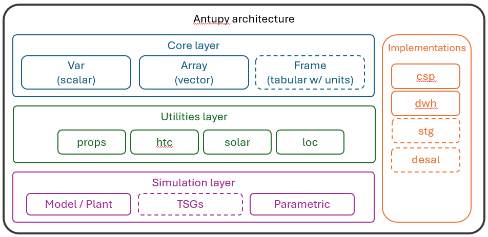

# Summary

`antupy`, from Mapuche language *antü*, meaning "sun"[@wiki_mapuche], is a Python package designed as a toolkit for energy system simulations. The package provides a framework organised around three type of classes. The core data types (`Var`, `Array`, `Frame`) for handling physical quantities with automatic unit conversion; abstract classes (`Model`, `Plant`, `Analyser`, `TimeSeriesGenerator`) that enable modular and extensible simulation workflows; and a suite of utility modules for thermophysical properties (`props`), heat transfer correlations (`htc`), and solar calculations (`solar`). Built on top of established scientific libraries including NumPy [@numpy], pandas [@pandas] (with a polars migration as a future project), and SciPy [@scipy]. This paper focuses on the core unit management system, some of the utility modules, and the abstract protocol architecture that enables researchers to develop custom energy system models with minimal boilerplate code while maintaining dimensional consistency throughout their simulations and post-processing.

# Statement of need

This software targets (energy/mechanical) engineering research and education. From undergraduates taking their first basic science courses to active researchers, computational tools that balance accessibility, flexibility, and rigor are essential for solving engineering problems. Energy and mechanical engineering programs increasingly rely on computational methods to teach thermodynamic cycles, heat transfer, and renewable energy systems. Simultaneously, researchers working on solar energy deployment need flexible frameworks to prototype novel system configurations, conduct parametric studies, and validate experimental results. These two domains—education and research—share a common need for tools that are both pedagogically transparent and sufficiently powerful for real-world applications.

Established energy simulation platforms such as System Advisor Model (SAM) [@nrel_sam], Engineering Equation Solver (EES) [@fchart_ees], and TRNSYS [@trnsys] have proven invaluable for industry applications and detailed system modeling. However, these tools present barriers for Python-based workflows, which have become the de facto standard in data science, machine learning, and modern scientific computing. While Python packages like TESPy [@witte2020tespy] provide thermal system modeling capabilities and pvlib [@holmgren2018pvlib] excels at photovoltaic performance simulation, there remains a gap for a general-purpose framework specialized in annual energy simulations that enables researchers to implement custom modules, control solvers, and integrate diverse energy technologies within a unified architecture. Existing Python tools often focus on specific technologies or require significant overhead to extend beyond their original scope.

A fundamental challenge in energy system modeling is the management of physical units across calculations involving thermodynamics, heat transfer, and fluid mechanics. Engineers routinely work with temperatures in Celsius and Kelvin, pressures in Pascals and bar, heat transfer rates in Watts and kW, and must ensure dimensional consistency when combining thermophysical properties from sources like CoolProp, convection correlations, and solar radiation models. While Python packages for unit management exist—such as Astropy [@astropy], Pint [@pint], and forallpeople [@forallpeople]—these tools do not seamlessly integrate unit variables across scalar (`Var`), vector (`Array`), and tabular (`Frame`) data structures. Furthermore, `antupy` employs simple, standard unit labels following intuitive rules (detailed in the documentation) that reduce cognitive overhead for engineers. By combining thermophysical property evaluation, heat transfer coefficient calculations, and solar geometry routines with automatic unit tracking and conversion, `antupy` provides a cohesive framework where physical quantities carry their units throughout the simulation workflow, reducing errors and improving code readability while integrating essential utilities for energy engineering into a single, coherent package.

# Software design

The `antupy` package architecture (Figure @fig:architecture) is organized around core data structures with two derived functional groups. The **core layer** provides three immutable data types: `Var` for scalar physical quantities, `Array` for homogeneous vector data (based on `numpy.ndarray` class), and `Frame` (extending `pandas.DataFrame`) for tabular data with per-column unit tracking. These types support arithmetic operations with automatic unit conversion and dimensional checking—for example, adding `Var(5.0, "kg")` and `Var(500, "g")` correctly yields `5.5 [kg]`. Building on these core classes, the **utilities modules** provide domain-specific functionality: `props` (thermophysical properties via CoolProp and some own implementations), `htc` (heat transfer correlations for natural and forced convection), `solar` (sun position and radiation calculations), and `loc` (geographical location management with Australian and Chilean databases). The **protocol/abstract classes** define interfaces for extensibility: `Model` (component-level solvers), `TimeSeriesGenerator` (weather and market data), `Plant` (system integration), and `Analyser` (parametric studies). Both the utilities and protocols are designed to be fully compatible with the core unit-aware data structures.

{#fig:architecture width=80%}

The package is designed for minimal friction in typical workflows. A simple example calculating heat stored in a domestic water heater from a cold tank until full hot tank, demonstrates the unit-aware approach:

```python
from antupy import Var
from antupy.props import Water

temp_max = Var(60, "degC")
temp_mains = Var(20, "degC")
vol_tank = Var(300, "L")
fluid = Water()

temp_avg = (temp_high+temp_mains)/2
cp = fluid.cp(temp_avg)
rho = fluid.rho(temp_avg)

q_stg = vol_tank * rho * cp * (temp_high - temp_mains)
q_stg = q_stg.su("kWh")

print(f"Energy stored: {q_stg:.1f}")
```

The `Parametric` analyser enables sensitivity studies by automatically managing parameter combinations and preserving units in results tables (stored as `Frame` objects). Current `TimeSeriesGenerator` implementations include market price data for Australia and Chile, as well as weather data through TMY (Typical Meteorological Year) and historical weather datasets. Comprehensive documentation is available online, including detailed introductions to the core variables, introductory examples, usage guides for the utility libraries, and the complete API reference. The package requires Python ≥3.12.


# Research Impact Statement

The `antupy` codebase represents a formalization and generalization of simulation frameworks developed during concentrated solar thermal (CST) and domestic water heating (DWH) research projects reported in several publications [@saldivia_optical_2021; @saldivia_novel_2023; @saldivia_thermal_2025]. The original basecodes of these simulations were updated using the current version of `antupy` and are publicly available online [@tm_solarshift, @bdr_csp]. Through these initial applications the core architecture was developed and the identified common patterns informed the protocols design. Current development priorities include updating other project-specific codebases, including desalination and energy storage applications [@saldivia_computational_2019, @valdivia_assessment_2020]. Finally, future enhancements will expand the `TimeSeriesGenerator` ecosystem to include additional weather data sources, electricity market price signals, and load profile generators for diverse human behaviour such as electricity or domestic hot water consumption. Community contributions are welcomed through the project's GitHub repository, with emphasis on maintaining the balance between educational clarity and research-grade capability that defines `antupy`'s design philosophy.

# AI usage disclosure

All the main classes were coded without any AI assistance, except by `Frame` and `Plant`, that were developed with assistance of VSCode-integrated Claude Sonnet 4.5. The same tool was used to develop part of the tests and the main classes docstrings using an iterative process.


# Acknowledgments

The author expresses gratitude to the projects ANID/FONDAP/1523A0006 "Solar Energy Research Center"—SERC-Chile and ANID's scholarship program "Becas Chile" (grant number TBD). Additionally, with the name, the author acknowledges the Mapuche people and its worldview as an inspiration. The first beta version of this codebase was written in Temuco, in Mapuche's heartland.

# References